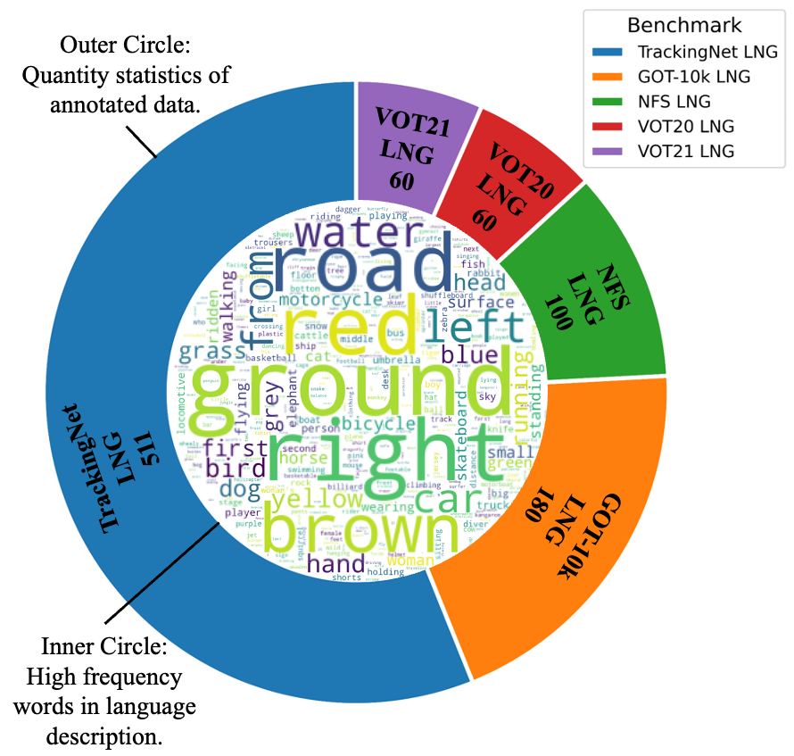

### 1. Enhanced Vision-Language Tracking(VLT) dataset

* **Name**：Enhanced VLT dataset. (include TrackingNet LNG, GOT-10k LNG, NFS LNG, VOT20 LNG and VOT21 LNG)
* **Background**: Manually add language annotations to official datasets. We hope these enhanced benchmarks will facilitate the understanding of vision-language tracking, fostering exploration of the potential and applicable scenarios in vision-language tracking.
* **Key difference**: Added language annotations to the existing dataset, which consist of textual descriptions of the target object in the first frame for vision-language object tracking, while the rest of the dataset remains entirely consistent with the original.


### 2. Annotation process & Usage

* **Annotation process**: we annotate the test sets of five visual tracking benchmarks. To ensure the reliability of the annotations, we manually label language annotations for all sequences. Our labeling personnel are organized into two groups: the labeling group and the verification group. To prevent information leakage, the labeling group is restricted to viewing only the first frame of the video and then describing the target in natural language. The verification group locates the target in the first frame based on the language description.  When the located target is consistent with the ground-truth target, the language labeling is considered qualified. 

* **Usage:** For the convenience of transmission, language annotations are provided here. When using it, you need to merge the language annotations with the official dataset. When the VOT dataset is evaluated using the official tool, you need to use **VOT_Benchmark_language.json** to read the language annotations of the corresponding frames. For detailed information, please refer to the relevant chapters of the paper.

  **Downloads:**

  ```
  Download this repo:
  git clone https://github.com/ChengAoZong/ProVLT.git
  
  Download in BaiduDisk:
  https://pan.baidu.com/s/1AD9r9vkjDMy9HM7ymJsQZA?pwd=1234 提取码: 1234 
  
  ```

  


### 3. Analysis & Examples

* **Analysis**

After removing duplicates, we annotate 857 video sequences with 456 different English words. The annotated descriptions focus on expressing the attributes and spatial location of the objects,  as illustrated in Figure below. The outer circle represents the number of annotated videos for each benchmark, while the inner circle depicts the frequency of words.

<div style="display: flex; justify-content: center">
  
</div>

* Examples


### 4. Acknowledgements

We extend our sincere gratitude to the teams behind the following benchmark datasets for their invaluable contributions to advancing visual object tracking research:

- **TrackingNet** for providing a large-scale, diverse dataset that enables robust training and evaluation in global object tracking scenarios.
- **GOT-10k** for offering a comprehensive benchmark with a unified evaluation protocol, fostering fair comparison and innovation in generic object tracking.
- **NFS** (Need for Speed) for its high-frame-rate videos that challenge and refine trackers in dynamic, real-time environments.
- **VOT2020** and **VOT2021** for continuously pushing the boundaries of tracking research through rigorous challenges, real-time evaluations, and adaptations to complex real-world scenarios.

We deeply appreciate the efforts of their creators in supporting the computer vision community.

### 5. Contact

If you have any questions, feel free to contact [me](chengaozong@mail.dlut.edu.cn).
